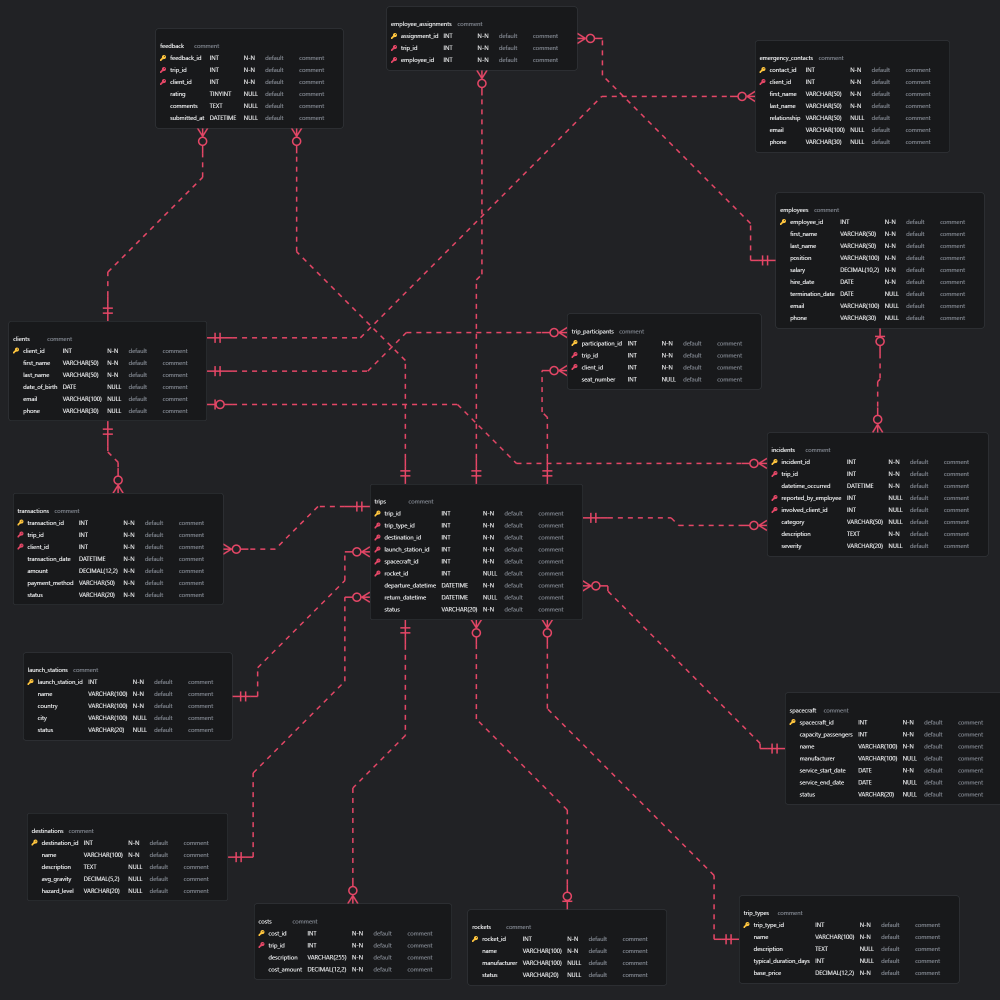

# Dokumentacja projektu bazy danych

Autorzy: *Jakub Ciągło, Mateusz Ćwiek, Marek Dworaczyk, Rafał Głodek*\
Data: 14 czerwca 2025

---

## 1. Użyte technologie

- **Quarto** – środowisko do generowania raportu
- **Python**
  - `random` – generowanie losowych wartości
  - `datetime`, `dateutil.relativedelta` – operacje na datach
  - `numpy`, `pandas`, `scipy` – przetwarzanie i analiza danych
  - `mysql.connector`, `sqlalchemy`, `pymsql` – łączenie i operacje na bazie MySQL/MariaDB
  - `faker` – sztuczne dane personalne
  - `Plotly` - wizualizacje w raporcie
  - `IPython.display` - tworzenie zautomatyzowanych Markdownów
- **SQL (MariaDB/MySQL)** – definicja i tworzenie schematu bazy           

---

## 2. Struktura repozytorium

| Ścieżka / plik        | Typ                                                                               | Zawartość                                                                 |
| --------------------- | --------------------------------------------------------------------------------- | ------------------------------------------------------------------------- |
| `baza_danych.sql`     | SQL                                                                               | Skrypt DDL: tworzy tabele, klucze główne i obce oraz indeksy |
| `skrypt.py`           | Python                                                                            | Funkcja `uruchom()` wypełnia bazę danymi testowymi (employees, clients, trips, …) |
| `raport.qmd`  | Quarto                                                                            | Notebook generujący wykresy i opis wyników; kompiluje się do HTML         |
| `raport.html` | HTML                                                                              | Wygenerowany raport ‑ gotowy do odczytu w przeglądarce                    |
| `schemat.png`         | PNG                                                                               | Schemat ER wygenerowany z `baza_danych.sql`                               |
| `dokumentacja.md`     | Markdown                                                                          | Pełna dokumentacja projektu (niniejszy plik)                              |

---

## 3. Instrukcja uruchomienia

1. **Utworzenie schematu bazy**
   ```bash
   mysql -h giniewicz.it -P 3306 -u team13 -p team13 < baza_danych.sql
   ```
2. **Wypełnienie danymi**
   ```bash
   python skrypt.py
   ```
3. **Wygenerowanie raportu**
   ```bash
   quarto render raport.qmd --to html
   ```
4. **Otworzyć `raport.html` w przeglądarce.**

---

## 4. Schemat bazy danych

Diagram ERD w pliku `schemat.png`.

---

## 5. Zależności funkcyjne

Poniższe podsekcje (5.1 – 5.14) prezentują dla każdej tabeli:

- **PK / AK** – klucz główny oraz (jeśli istnieje) alternatywny `UNIQUE`
- **FD** – nietrywialne zależności funkcyjne

#### 5.1 `clients`

- **PK** `client_id`
- **AK** `email`
- **FD**
  - `client_id → first_name, last_name, date_of_birth, email, phone`
  - `email → client_id, first_name, last_name, date_of_birth, phone`

#### 5.2 `employees`

- **PK** `employee_id`
- **AK** `email`
- **FD**
  - `employee_id → first_name, last_name, position, salary, hire_date, termination_date, email, phone`
  - `email → employee_id, first_name, last_name, position, salary, hire_date, termination_date, phone`

#### 5.3 `destinations`

- **PK** `destination_id`
- **AK** `name`
- **FD**
  - `destination_id → name, description, avg_gravity, hazard_level`
  - `name → destination_id, description, avg_gravity, hazard_level`

#### 5.4 `trip_types`

- **PK** `trip_type_id`
- **AK** `name`
- **FD**
  - `trip_type_id → name, description, typical_duration_days, base_price`
  - `name → trip_type_id, description, typical_duration_days, base_price`

#### 5.5 `launch_stations`

- **PK** `launch_station_id`
- **AK** `name`
- **FD**
  - `launch_station_id → name, country, city, status`
  - `name → launch_station_id, country, city, status`

#### 5.6 `rockets`

- **PK** `rocket_id`
- **AK** `name`
- **FD**
  - `rocket_id → name, manufacturer, status`
  - `name → rocket_id, manufacturer, status`

#### 5.7 `spacecraft`

- **PK** `spacecraft_id`
- **AK** `name`
- **FD**
  - `spacecraft_id → capacity_passengers, name, manufacturer, service_start_date, service_end_date, status`
  - `name → spacecraft_id, capacity_passengers, manufacturer, service_start_date, service_end_date, status`


#### 5.8 `trips`

- **PK** `trip_id`
- **FD**
  - `trip_id → trip_type_id, destination_id, launch_station_id, spacecraft_id, rocket_id, departure_datetime, return_datetime, status`

#### 5.9 `trip_participants`

- **PK** `participation_id`
- **AK** `(trip_id, client_id)`
- **FD**
  - `participation_id → trip_id, client_id, seat_number`
  - `(trip_id, client_id) → participation_id, seat_number`

#### 5.10 `employee_assignments`

- **PK** `assignment_id`
- **AK** `(trip_id, employee_id)`
- **FD**
  - `assignment_id → trip_id, employee_id`
  - `(trip_id, employee_id) → assignment_id`

#### 5.11 `transactions`

- **PK** `transaction_id`
- **FD**
  - `transaction_id → trip_id, client_id, transaction_date, amount, payment_method, status`

#### 5.12 `costs`

- **PK** `cost_id`
- **FD**
  - `cost_id → trip_id, description, cost_amount`

#### 5.13 `incidents`

- **PK** `incident_id`
- **FD**
  - `incident_id → trip_id, datetime_occurred, reported_by_employee, involved_client_id, category, description, severity`

#### 5.14 `feedback`

- **PK** `feedback_id`
- **FD**
  - `feedback_id → trip_id, client_id, rating, comments, submitted_at`

---

## 6. Uzasadnienie formy EKNF

Elementary Key Normal Form (EKNF) wymaga, aby dla każdej nietrywialnej zależności funkcyjnej **X → Y** zachodzącej w relacji, zbiór atrybutów **X** był kluczem *lub* żeby każda składowa **Y** należała do klucza.

#### Jak spełniamy ten warunek

- **Jednoznaczne identyfikatory** – w większości tabel stosujemy proste klucze główne `…_id` (`INT AUTO_INCREMENT`).
- **Atrybuty unikalne** – tam, gdzie naturalny identyfikator ma sens (`email`, `name`, para `(trip_id, employee_id)`), dodaliśmy ograniczenia `UNIQUE`; powstają klucze kandydujące.
- **Tabele łącznikowe** – w `employee_assignments` i `trip_participants` kluczem kandydującym jest zarówno syntetyczne `assignment_id` / `participation_id`, jak i para obcych kluczy.
- **Zależności funkcyjne** – jedynymi nietrywialnymi zależnościami są te z rozdziału 5; każda ma po lewej stronie klucz kandydujący (spełnia to pierwszy warunek definicji).
- **Brak zależności między kolumnami nie‑kluczowymi** – np. `salary` nie determinuje `position`, a `first_name` nie determinuje `last_name`.

W rezultacie **każda tabela** spełnia kryteria EKNF.

---

## 7. Co było najtrudniejsze

- Zadbanie o pełną EKNF – każda tabela wymagała przemyślenia kluczy i usunięcia nadmiarowych kolumn czy zależności.
- Spójne generowanie dat – przesunięcie całego okresu o 100 lat plus 5 lat historii wymagało pilnowania, aby wszystkie daty zachowały realną kolejność.
- Harmonogramowanie zasobów (statki, rakiety, załoga, klienci) bez kolizji – implementacja detekcji konfliktów terminów.

---

## 8. Bibliografia

1. Elmasri & Navathe: *Fundamentals of Database Systems*, 7 ed.
2. MySQL 8.3 *Reference Manual* – rozdz. 13 („Constraints & Indexes”).
3. Date, C.J.: *An Introduction to Database Systems* – rozdz. o normalnych formach.

---
